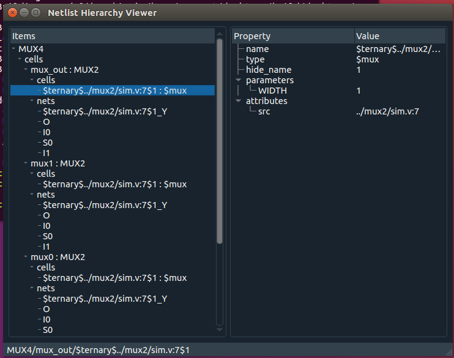

# Dark Tree Netlist Hierarchy Viewer

> Dark tree! still sad when other's grief is fled,  
> The only constant mourner o'er the dead.

Dark Tree is a Hierarchical Netlist Viewer for Yosys JSON Netlists. It's pretty obvious to use because it doesn't do much yet.

## Design

Dark Tree is written in Python 3 with PySide2.
